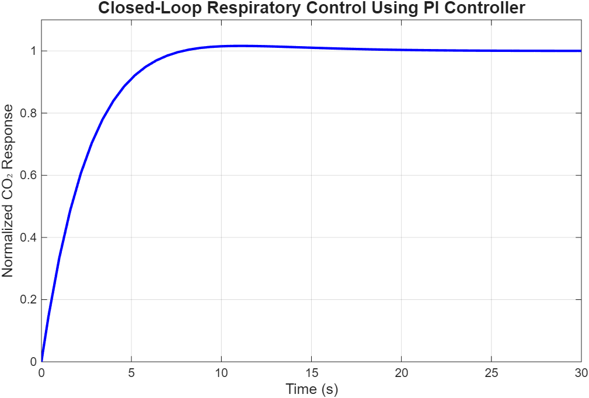
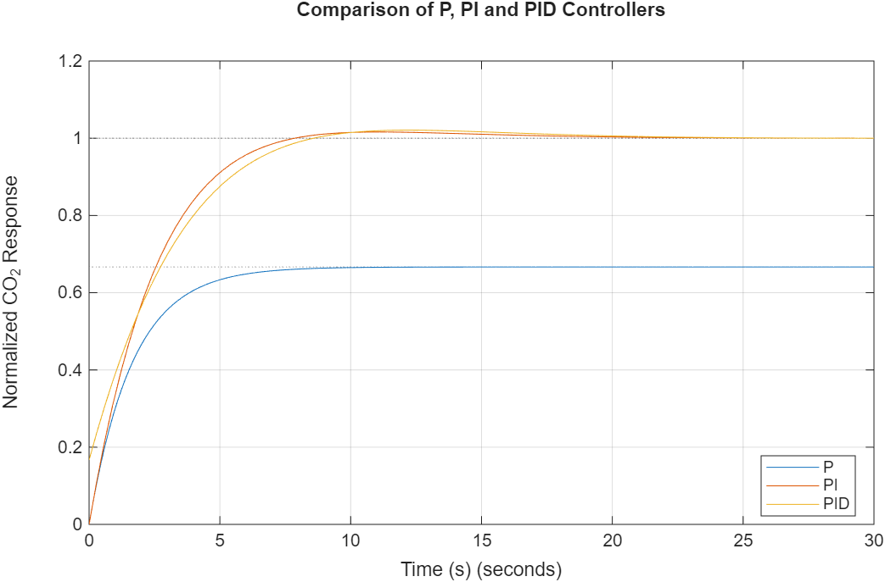
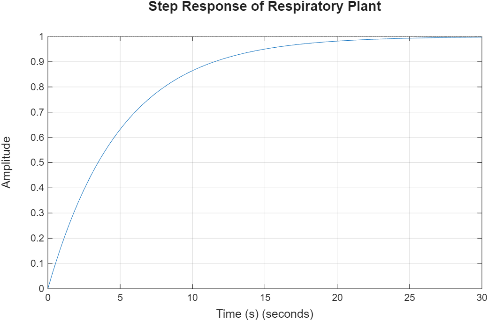

# Respiratory Rate Control System using MATLAB and Simulink

## Overview

This project models a closed-loop respiratory rate control system using MATLAB and Simulink. A first-order respiratory plant is controlled using P, PI, and PID controllers to analyze system performance and compare their responses.

## Features

- Closed-loop respiratory control model
- P, PI, and PID controller implementation
- Step response analysis
- Controller performance comparison
- MATLAB and Simulink implementation

## Tools Used

- MATLAB R2025b
- Simulink
- Control System Toolbox

## Project Files

- analysis.m
- RespiratoryRateControl.slx
- Step_Response.png
- P_Controller_Response.png
- PI_Controller_Response.png
- PID_Controller_Response.png
- P_PI_PID_Comparison.png

## Results

## Results

### Closed-Loop PI Controller Response

### P, PI and PID Controller Comparison

### Respiratory Plant Step Response

## How to Run

1. Open `RespiratoryRateControl.slx` in MATLAB.
2. Run the simulation.
3. Execute `analysis.m`.
4. View the generated response plots.

## Author

Veshmitha Devi D S

Medical Electronics Engineering
